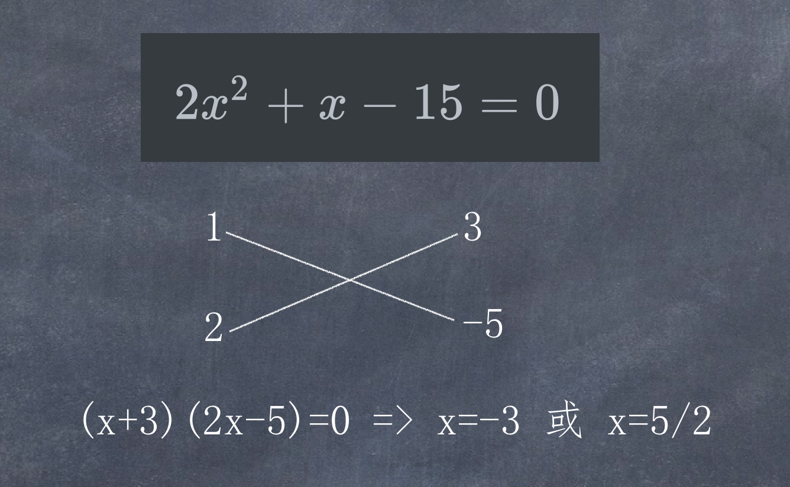

# 一元二次方程

一元二次方程公式:  
$$ax^2 + bx + c = 0\quad(a\neq0)$$

### 求根推导公式   
$$x= \frac{-b \pm \sqrt{b^2-4ac}}{2a}$$

推导公式, 可采用配方法:  
$$(a \pm b)^2 = a^2 + b^2 + 2ab$$

$$\because ax^2 + bx + c = 0$$
$$\therefore x^2 + \frac{b}{a}x + c = 0$$
$$\therefore x^2 + \frac{b}{a}x = -c$$

要把这个公式配成 $$(x + ?)^2$$, 即 $$x^2 + ?^2 + 2x?$$, 对应上面方程式:

$$x^2 + \frac{b}{a}x = -c$$
$$x^2 + 2?x + ?^2$$ 则:
$$2? = \frac{b}{a}$$, 则$$? = \frac{b}{2a}$$

因此方程两端各加上 $$(\frac{b}{2a}) ^ 2$$

$$x^2 + \frac{b}{a}x + (\frac{b}{2a}) ^ 2 = -c + (\frac{b}{2a}) ^ 2$$ = $$-c + \frac{b^2}{4a^2}$$ = $$\frac{b^2-4ac}{4a^2}$$

$$(x+\frac{b}{2a})^2 = \frac{b^2-4ac}{4a^2}$$    

$$x+\frac{b}{2a} = \pm \sqrt{\frac{4a^2}{b^2-4ac}}$$

$$x = \frac{b}{-2a} \pm \frac{\sqrt{b^2-4ac}}{2a} = \frac{-b \pm \sqrt{b^2-4ac}}{2a}$$

配方法的总结: 只需要对一元系数除以2再平方即可, 比如对于上面的一元系数$\frac{b}{a}$, 需要除以2再平方变成$$(\frac{b}{2a})^2$$, 这里的$$(\frac{b}{2a})^2$$就是要配成完全平方式需要等式左右各加的数

因上公式可知:
$$\Delta = b^2-4ac$$
当$$\Delta = 0$$时, 方程有一个根: $$-\frac{b}{2a}$$  
当$$\Delta > 0$$时, 方程有两个根: $$\frac{-b \pm \sqrt{b^2-4ac}}{2a}$$ 
当$$\Delta < 0$$时, 方程无实根

### 十字相乘法推导公式

先来看一下使用十字相乘法解题的方式:  
$$2x^2+x-15 = 0$$ 

十字相乘法的推导:  

设一元二次方程为

$$Ax^2 + Bx + C = 0$$
如果：  
$$A = A_1A_2, C=C_1C_2$$, 且 $$A_1C_2 + A_2C_1=B$$  
$$(A_1x + C_1) \times (A_2x + C_2) =  A_1A_2x^2 + (A_1C_2+A_2C_1) \cdot x + C_1C_2 = Ax^2+Bx+C $$