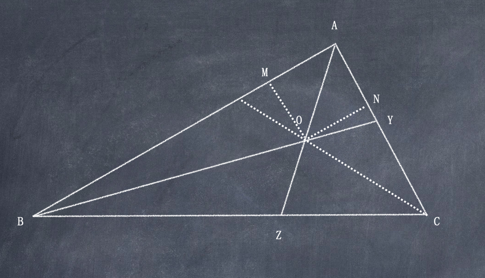

# 三角形内切圆

任意一个三角形有且仅有一个内切圆 

这个证明和三角形角平分线相交于一点的证明相同  

设角平分线AZ、BY交于O，
∵AZ平分∠BAC，作OM垂直于AB, ON垂直于AC
∵三角形AOM和三角形AON是全等三角形
∴O到AB、AC的距离相等
同理O到BA、BC的距离相等
∴O到CA、CB距离相等，
∴O在∠BCA的平分线上，
∴三角形三条边的三条角平分线相交于一点, 此点到三边的垂直相同

这个交点就是内切圆圆心, 由于O到三角形三边距离分别是最短的, 因此可以画一个内切圆. 
