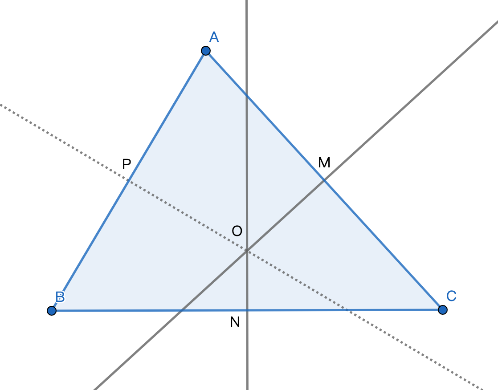

# 三角形外接圆

外接圆定义: 与多边形各顶点都相交的圆叫做多边形的外接圆
求证: 任意一个三角形有且仅有一个外接圆
这个证明和三角形边的垂直平分线相交于一点的证明相同 (三角形的外接圆圆心是任意两边的垂直平分线的交点。 三角形外接圆圆心叫外心)  

如图, 三角形ABC中, 作BC的中垂线交BC于N, 作AC的中垂线交AC于M, 两个中垂线相交于点O, 连OP交AB于P, 其中P是AB的中点
求证: OP垂直于AB

证明: 

∵ OM, ON是中垂线
∴ AO = OC = OB
∴ 三角形AOP和三角形BOP是全等三角形, 由OA = OB 可知, OP垂直于
由 AO = OC = OB 也可知, 点 O 是三角形ABC的外接圆圆心
