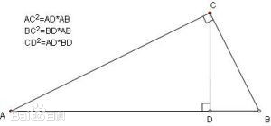

# 相似和全等三角形

在证明之前, 先来回顾一下全等三角形与相似三角形的性质

| 分类 | 全等三角形 | 相似三角形 |
| :------------ |:---------------| :-----|
| 定义      | 形状与大小都完全相同的两个三角形，或能够完全重合的两个三角形称作全等三角形 | 对应角相等、对应边成比例的两个三角形叫做相似三角形 (也可以说或形状相同大小不同的两个三角形) |
| 性质      | 1、全等三角形的对应角相等、对应边相等  2、全等三角形的对应线段相等﹙即对应高、中线、角平分线﹚ | 1、相似三角形的对应角相等，对应边成比例。这个比叫做相似比 2、两个相似三角形的对应的高、中线、角平分线的比等于相似比 3、相似三角形周长的比等于相似比.  4、相似三角形的面积比等于相似比的平方 |
| 判定 | 1、三组对应边分别相等的两个三角形全等(简称SSS或“边边边”) 2、有两边及其夹角对应相等的两个三角形全等(SAS或“边角边”) 3、有两角及其夹边对应相等的两个三角形全等(ASA或“角边角”) 4、有两角及其一角的对边对应相等的两个三角形全等(AAS)或“角角边” 5、斜边及一直角边对应相等的两个直角三角形全等(HL或“斜边，直角边”) | 1、两角分别对应相等的两个三角形相似 2、两边成比例且夹角相等的两个三角形相似 3、三边成比例的两个三角形相似 4、一条直角边与斜边成比例的两个直角三角形相似    推论 三边对应平行的两个三角形相似 推论 一个三角形的两边和三角形任意一边上的中线与另一个三角形的对应部分成比例，那么这两个三角形相似 |

### 相似三角形的特殊情况

1.凡是全等的三角形都相似

全等三角形是[特殊](https://baike.baidu.com/item/特殊)的相似三角形，[相似比](https://baike.baidu.com/item/相似比)为1。反之，当相似比为1时，相似三角形为全等三角形。
2. 有一个顶角或底角相等的两个[等腰三角形](https://baike.baidu.com/item/等腰三角形)都相似
由此，所有的[等边三角形](https://baike.baidu.com/item/等边三角形)都相似。  

### 射影定理 

首先要清楚比例中项: 若a/b =b/c，即b²=ac，b叫做a,c的比例中项  

射影定理（又叫欧几里德(Euclid)定理）俗称母子三角形：直角三角形中，斜边上的高是两直角边在斜边上射影的比例中项。每一条直角边是这条直角边在斜边上的射影和斜边的比例中项    

即:  $\frac{AD}{BD} = \frac{BD}{CD}$ 即 $BD^2 = AD\times{CD}$  

在Rt△ABC中，∠ABC=90°，BD是斜边AC上的高，则有射影定理如下：

**BD²=AD·CD**
**AB²=AC·AD**
**BC²=CD·AC**  

由古希腊著名数学家、《几何原本》作者欧几里得提出  
此外，当这个三角形不是直角三角形但是角ABC等于角CDB时也成立。可以使用相似进行证明，过程略  

①CD²=AD·BD;
②AC²=AD·AB;
③BC²=BD·AB;
④AC·BC=AB·CD
证明：
①∵CD²+AD²=AC²,CD²+BD²=BC²
∴2CD²+AD²+BD²=AC²+BC²
∴2CD²=AB²-AD²-BD²
∴2CD²=(AD+BD)²-AD²-BD²
∴2CD²=AD²+2AD·BD+BD²-AD²-BD²
∴2CD²=2AD·BD
∴CD²=AD·BD

②∵CD²=AD·BD(已证)
∴CD²+AD²=AD·BD+AD²
∴AC²=AD·(BD+AD)
∴AC²=AD·AB

③BC²=CD²+BD²
BC²=AD·BD+BD²
BC²=(AD+BD)·BD
BC²=AB·BD
∴BC²=AB·BD

④∵S△ACB= AC×BC= AB·CD
∴ AC·BC= AB·CD
∴AC·BC=AB·CD

使用三角函数也可表示为:  

a=bcosC+ccosB
b=ccosA+acosC
c=acosB+bcosA